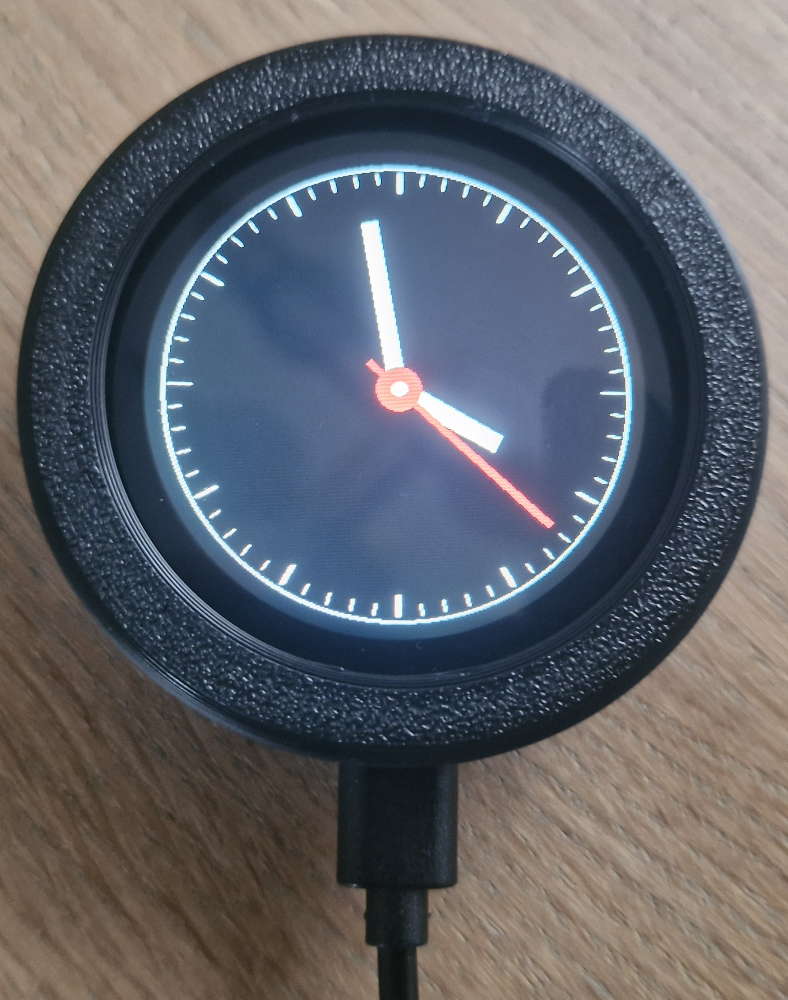
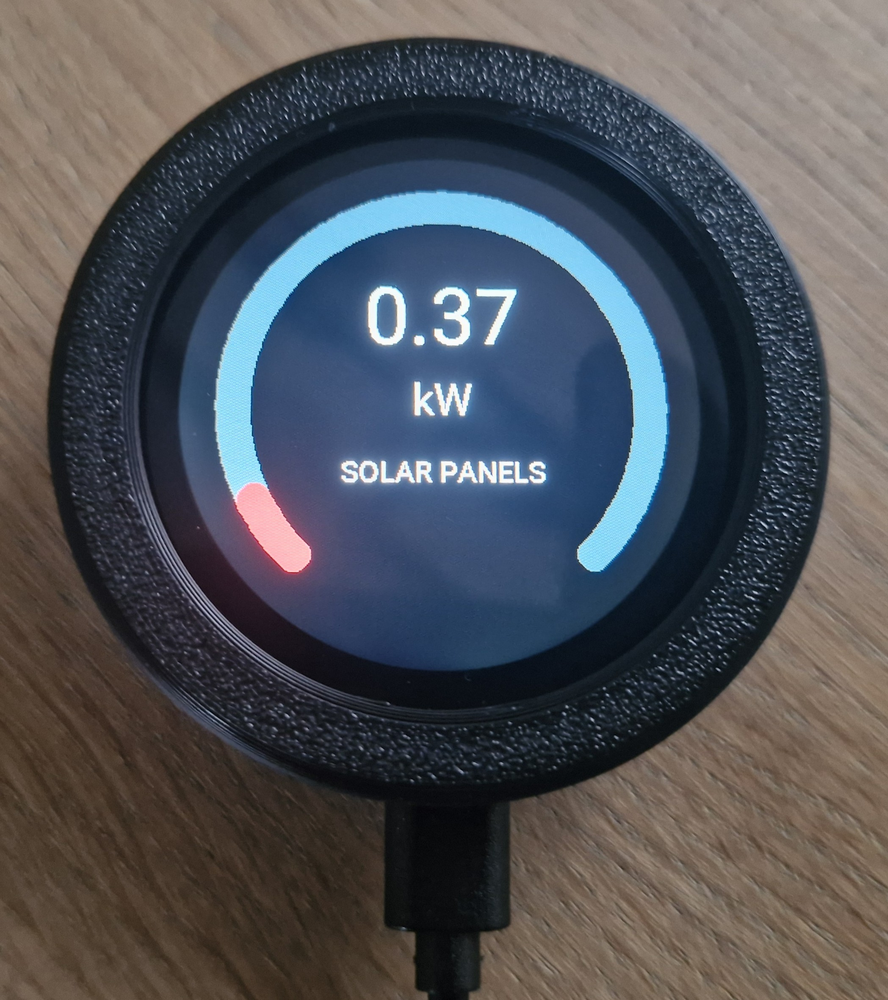
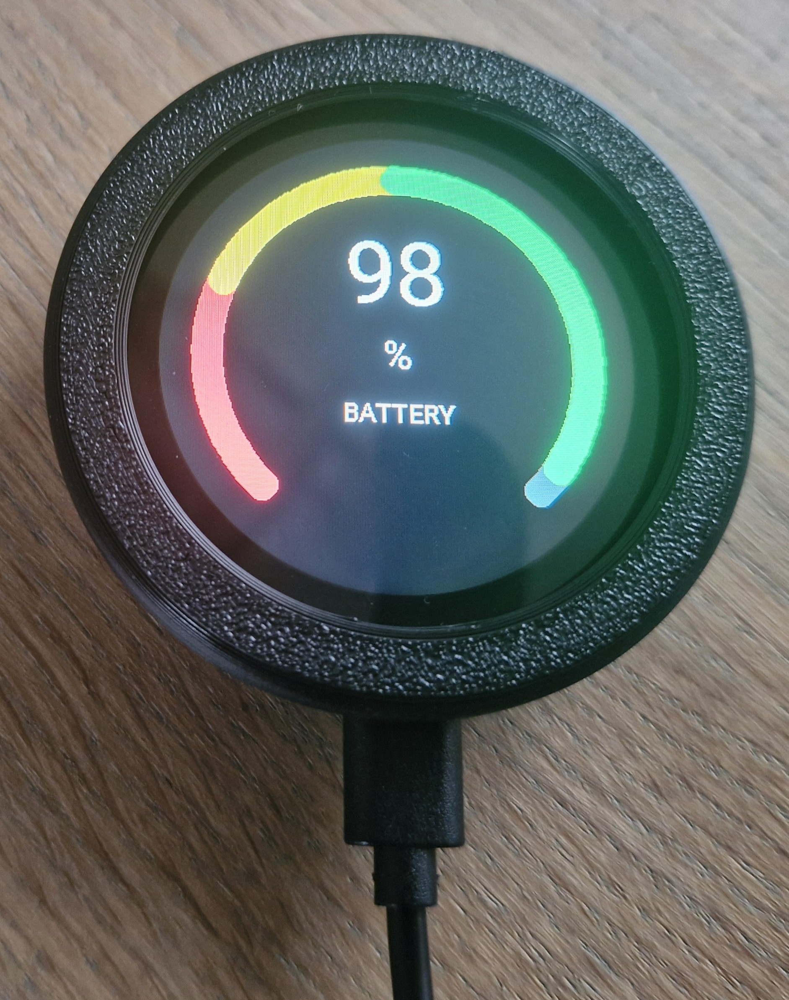
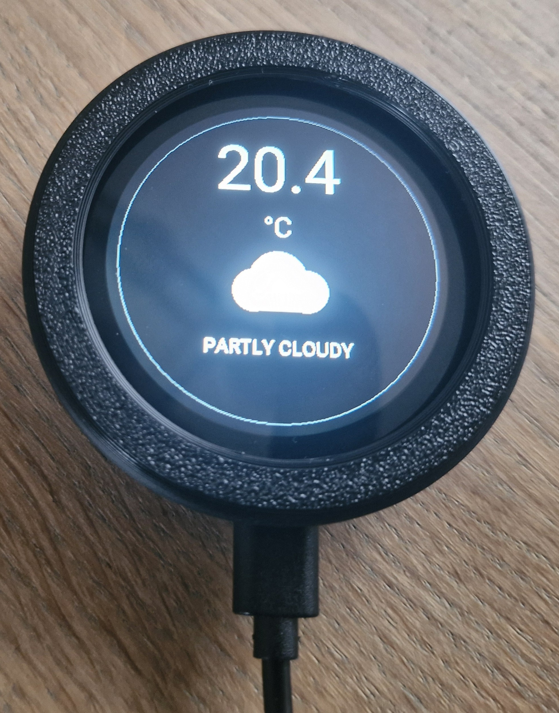
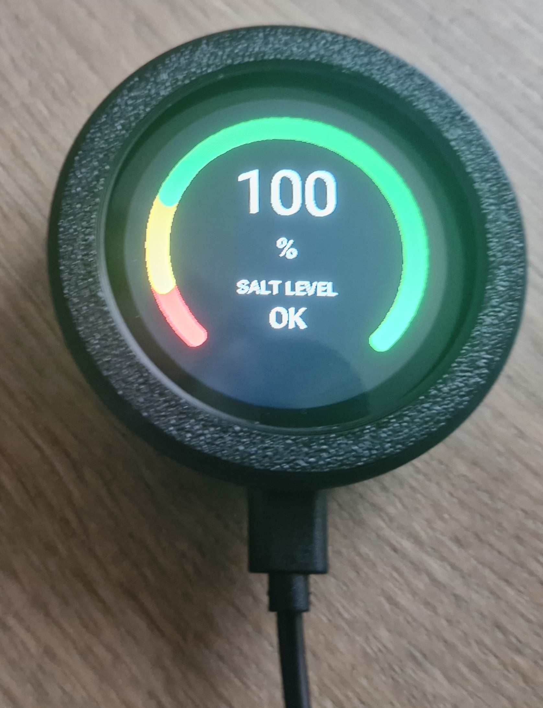
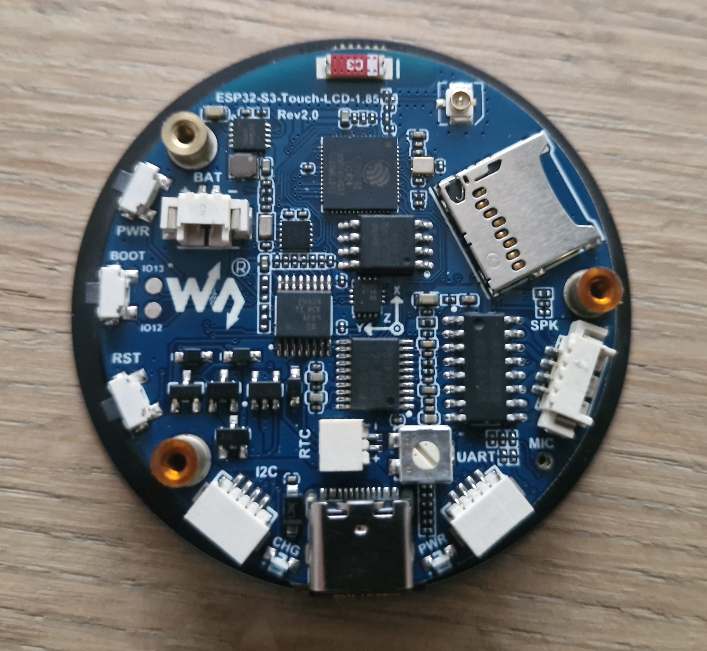

# PUK – Waveshare ESP32-S3 1.85" Smart Home Dashboard

A compact, round **PUK-style 3D-printed housing** for the [Waveshare ESP32-S3-Touch-LCD-1.85](https://www.waveshare.com/esp32-s3-touch-lcd-1.85.htm).

The project combines a 1.85" round touchscreen, ESPHome and Home Assistant into a small desktop or wall-mounted information display.


## ✨ Features

- Round **1.85" 360×360 touchscreen**
- ESP32-S3 based
- Designed specifically for the **Waveshare ESP32-S3-Touch-LCD-1.85 Rev 2.0**
- Compact **PUK-style enclosure**
- Can be used freestanding or mounted to a wall
- USB-C powered
- ESPHome firmware
- Home Assistant integration
- Touchscreen page navigation using horizontal swipes
- Automatic page rotation
- Short configurable pause after manual interaction
- Clean gauge-style UI

## 📊 Dashboard pages

The current ESPHome configuration contains five pages:

| Page | Information |
|---|---|
| 🕐 Clock | Analog clock with hour, minute and second hands |
| ☀️ Solar | Current solar production in kW |
| 🔋 Battery | Battery state of charge |
| 🌤️ Weather | Current temperature and weather condition |
| 🧂 Salt | Salt level percentage and refill status |

The displayed values are retrieved from Home Assistant entities through the ESPHome API.

## 🖐️ Touch controls

The display uses horizontal swipe gestures:

- **Swipe left** → next page
- **Swipe right** → previous page

After a manual swipe, automatic rotation is paused for **20 seconds**.

When there is no manual interaction, the display automatically changes page every **5 seconds**.


## 🏠 Home Assistant

The ESPHome configuration currently reads the following information from Home Assistant:

- Solar production
- Battery level
- Salt level
- Weather temperature
- Weather condition

The exact Home Assistant entity IDs are defined in the ESPHome YAML and can be changed to match your own installation.

### Current entities

```yaml
sensor:
  - platform: homeassistant
    id: solar_power
    entity_id: sensor.solis_1031720262250153_c0_5d_89_ec_4e_37_pv_total_1_actual_power_total_s

  - platform: homeassistant
    id: battery_level
    entity_id: sensor.batterij_bruikbaar

  - platform: homeassistant
    id: salt_level
    entity_id: sensor.zoutlevelsensor_salt_level_percentage

  - platform: homeassistant
    id: weather_temperature
    entity_id: weather.huis
    attribute: temperature
```

Change these entity IDs before using the project on another Home Assistant installation.

## 🧩 Hardware

### Main board

**Waveshare ESP32-S3-Touch-LCD-1.85 Rev 2.0**

The board provides the main components required by the project:

- ESP32-S3
- 1.85" round display
- Capacitive CST816 touchscreen
- QSPI display interface
- I²C peripherals
- Speaker connector
- RTC connector
- Battery connector
- microSD card slot
- USB-C


### Enclosure

The enclosure consists of several 3D-printed parts:

- Main rear housing
- Front retaining bezel/ring
- Rear cover
- Display/front panel

The design keeps the round form factor of the display and provides a clean bezel around the screen.

The rear housing includes mounting points so the PUK can also be fixed to a wall.

## 🖨️ 3D printing

The PUK enclosure is designed to be simple to print and easy to assemble.

The main enclosure consists of:

- **One backhousing**
- **One frontplate / front ring**

The backhousing has **one screw hole**. This can be used for wall mounting or, when using the PUK on a desk, simply left unused.

Print files are available on MakerWorld.

**MakerWorld:** (link coming soon)

### Recommended material

The housing can be printed in common FDM materials such as:

- PLA
- PLA+
- PETG

For normal indoor use, PLA/PLA+ works well.

For warmer locations or areas with more direct sunlight, PETG is recommended.

### Suggested print settings

These are starting points and can be adjusted to your printer and filament:

```text
Layer height:       0.16–0.20 mm
Walls:              3
Top layers:         4
Bottom layers:      4
Infill:             15–25%
Supports:           Normally not required
```

## 🔧 Assembly

The PUK is designed for a simple two-part assembly.

### 1. Prepare the backhousing

Place the Waveshare ESP32-S3-Touch-LCD-1.85 into the backhousing.

**Important:** make sure the **USB-C connector is correctly aligned with the opening in the housing** before continuing.

### 2. Install the frontplate

Once the ESP/display is correctly positioned, place the frontplate on the housing and secure it with the screw.

The frontplate holds the display securely in place.

## 🧱 Wall mounting

There are two ways to mount the PUK to a wall.

### Option 1 – Use the screw hole in the backhousing

The single screw hole in the backhousing can be used directly for wall mounting.

**Important:** install the backhousing on the wall **before placing the display/ESP into the housing**.

1. Mount the empty backhousing to the wall using the screw hole.
2. Place the Waveshare ESP32-S3-Touch-LCD-1.85 into the mounted backhousing.
3. Make sure the USB-C port is correctly aligned with the opening.
4. Install and screw on the frontplate.

**Disadvantage:** because the backhousing is already mounted to the wall, attaching the frontplate is somewhat more difficult.

### Option 2 – Use the separate mounting ring

For easier wall installation, use the optional **mounting ring**.

1. Download and print the mounting ring.
2. Attach the mounting ring to the wall.
3. Prepare the PUK display by installing the ESP/display in the backhousing.
4. Align the finished display with the mounting ring.
5. Place the PUK into the mounting ring.

This option makes it easier to install and remove the complete display from the wall.

The mounting ring is available as a separate print file on MakerWorld.

**MakerWorld:** (link coming soon)

## 💻 Software

The project is built around:

- **ESPHome**
- **Home Assistant**
- ESP-IDF
- Waveshare ESP32-S3-Touch-LCD-1.85 hardware

The display is driven using the ESPHome `mipi_spi` display component in quad mode.

The touchscreen uses the CST816 controller.

The display backlight is controlled through GPIO5.


## 🎨 Display UI

The UI uses a consistent dark background with high-contrast white text and coloured status indicators.

The gauge pages use a three-stage colour scale:

```text
RED → YELLOW → GREEN
```

The clock uses a traditional analogue watch-style layout with:

- 60 minute/second markers
- White hour and minute hands
- Red second hand
- Red centre hub

## ⚙️ Configuration

The ESPHome configuration defines the display pages as numeric page IDs:

```text
0 = Clock
1 = Solar
2 = Battery
3 = Weather
4 = Salt
```

The automatic page rotation and touch handling are implemented directly in the display/touchscreen configuration.

The display is configured for:

```yaml
model: JC3636W518
bus_mode: quad
data_rate: 40MHz
pixel_mode: 16bit
color_depth: 16
rotation: 0
```

## 📷 Project photos

### Complete PUK


### Clock



### Solar production



### Battery



### Weather



### Salt level



### ESP32-S3 board




## 🛠️ Customization

The project is intentionally easy to adapt.

You can change:

- Home Assistant entities
- Page order
- Page rotation interval
- Touch pause duration
- Gauge thresholds
- Gauge colours
- Fonts and font sizes
- Display graphics
- Additional dashboard pages

For example, the automatic page interval is currently:

```cpp
5000
```

which corresponds to 5 seconds.

The manual touch pause is currently:

```cpp
20000
```

which corresponds to 20 seconds.

## 🤝 Contributions

Suggestions, improvements and additional Home Assistant pages are welcome.

If you create a modified enclosure or add another dashboard page, feel free to share it with the project.

## 📜 License

Add the license that matches how you want the 3D models and firmware to be reused.

---

**Designed as a compact Home Assistant information display using the Waveshare ESP32-S3-Touch-LCD-1.85.**
